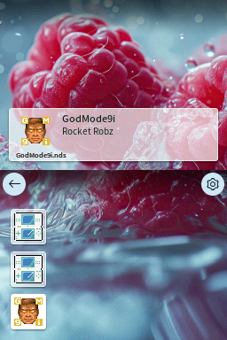
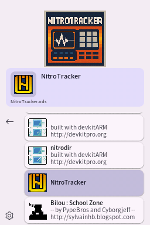

# Pico Launcher
This repository contains Pico Launcher, which is a front-end for [Pico Loader](https://github.com/LNH-team/pico-loader).





## Features
- Can load homebrew and retail games using [Pico Loader](https://github.com/LNH-team/pico-loader).
- Various display modes
    - Horizontal and vertical icon grid
    - Banner list
    - Coverflow
- [File associations](docs/FileAssociations.md)
- [Covers](docs/Covers.md)
- [Material Design 3 and custom themes](docs/Themes.md)
- Support for background music (see [Themes](docs/Themes.md))
- Support for cheats (See [Cheats](docs/Cheats.md))

General usage documentation can be found here: [Usage](docs/Usage.md).

## Setup & Configuration
We recommend using WSL (Windows Subsystem for Linux), or MSYS2 to compile this repository.
The steps provided will assume you already have one of those environments set up.

1. Install [BlocksDS](https://blocksds.skylyrac.net/docs/setup/options/)

## Compiling

1. Run `make`

The launcher can be found in the root directory under the name `LAUNCHER.nds`.

2. Copy `LAUNCHER.nds` to your SD card.
    - If you are using DSpico, rename to `_picoboot.nds` and place it in the root of your SD card.
3. Copy the `_pico` pico folder to the root of your SD card.

> [!NOTE]
> To use Pico Launcher, the Pico Loader files (`aplist.bin`, `savelist.bin`, `picoLoader7.bin` and `picoLoader9.bin`) must also be present in the `/_pico` folder on your SD card.

For DSpico the final directory structure will look like this:
```
.
├── _pico
│   ├── themes
│   │   ├── material
│   │   │   └── theme.json
│   │   └── raspberry
│   │       ├── bannerListCell.bin
│   │       ├── bannerListCellPltt.bin
│   │       ├── bannerListCellSelected.bin
│   │       ├── bannerListCellSelectedPltt.bin
│   │       ├── bottombg.bin
│   │       ├── gridcell.bin
│   │       ├── gridcellPltt.bin
│   │       ├── gridcellSelected.bin
│   │       ├── gridcellSelectedPltt.bin
│   │       ├── scrim.bin
│   │       ├── scrimPltt.bin
│   │       ├── theme.json
│   │       └── topbg.bin
│   ├── aplist.bin
│   ├── savelist.bin
│   ├── picoLoader7.bin
│   └── picoLoader9.bin
└── _picoboot.nds
```
Note: If you want to play DSiWare on the DSpico, additional files are required. See the [Pico Loader](https://github.com/LNH-team/pico-loader) readme for more information.

## License

Icons by [icons8](https://icons8.com/)

This project is licensed under the Zlib license. For details, see `LICENSE.txt`.

Additional licenses may apply to the project. For details, see the `license` directory.

## Contributors
- [@Gericom](https://github.com/Gericom)
- [@XLuma](https://github.com/XLuma)
- [@Dartz150](https://github.com/Dartz150)
- [@lifehackerhansol](https://github.com/lifehackerhansol)
