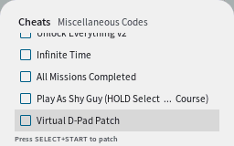

# Cheats
Pico Launcher supports cheats from a `usrcheat.dat` file placed at `/_pico/usrcheat.dat`. The file stores the cheat codes, as well as which cheats are enabled. When a game is started which has cheats enabled, the enabled cheats are passed to Pico Loader.

## Usage
To display the available cheats highlight a game in the rom browser and press Y to access the cheats panel.

### Controls
- DPAD up/down: Scroll through the list of cheats.
- L and R: Scroll quickly when there are many cheats.
- A: Toggle a cheat on/off, or go into a cheat category.
- B: Go up in the cheat hierarchy, or close the cheats panel when at the root.
- Y: Close the cheats panel.
- X: Disable all cheats.
