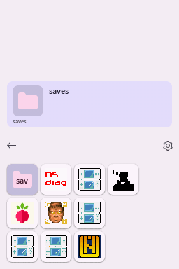

# Themes
Using themes, the look and feel of Pico Launcher can be customized. Themes are placed in subfolders of the `/_pico/themes` folder. For example `/_pico/themes/my_theme`.

## JSON file
Each theme has a `theme.json` file with information about the theme.

- **type** - Type of theme. Currently `material` and `custom` are supported. See below for information about each type.
- **name** - The name of the theme.
- **description** - Description of the theme.
- **author** - Author of the theme.
- **primaryColor** - Material Design 3 primary color to use. `r`, `g` and `b` are provided in range 0-255.
- **darkTheme** - When `true`, a dark Material Design 3 palette will be used.

### Example
```json
{
    "type": "material",
    "name": "Theme name",
    "description": "Theme description here.",
    "author": "Author Name",
    "primaryColor": {
        "r": 149,
        "g": 143,
        "b": 237
    },
    "darkTheme": true
}
```

## Material type


The `material` type theme is a pure Material Design 3 theme. It will be fully themed based on the `primaryColor` and `darkTheme` settings from the `theme.json`. In coverflow mode, this theme type uses a Material Design 3 style carousel.

## Custom type


The `custom` type theme is much more customizable, compared to the `material` type theme.
Note that the `primaryColor` and `darkTheme` settings from the `theme.json` are still used to color some parts of the UI.

The following additional files are needed:
| Files                                                        | Size                 | Format                   | Description                                                    |
|--------------------------------------------------------------|----------------------|--------------------------|----------------------------------------------------------------|
| bannerListCell.bin<br>bannerListCellPltt.bin                 | 256x49 (209x49 used) | A3I5<br>32 color palette | Unselected item background for banner list mode.               |
| bannerListCellSelected.bin<br>bannerListCellSelectedPltt.bin | 256x49 (209x49 used) | A3I5<br>32 color palette | Selected item background for banner list mode.                 |
| bottombg.bin                                                 | 256x192              | 15 bpp bitmap            | Bottom screen background.                                      |
| gridcell.bin<br>gridcellPltt.bin                             | 64x48 (48x48 used)   | A3I5<br>32 color palette | Unselected item background for grid modes.                     |
| gridcellSelected.bin<br>gridcellPlttSelected.bin             | 64x48 (48x48 used)   | A3I5<br>32 color palette | Selected item background for grid modes.                       |
| scrim.bin<br>scrimPltt.bin                                   | 8x42                 | A5I3<br>8 color palette  | Background for the toolbar. Intended to be a translucent fade. |
| topbg.bin                                                    | 256x192              | 15 bpp bitmap            | Top screen background.                                         |

These files can be created, for example, using [NitroPaint](https://github.com/Garhoogin/NitroPaint).

The top screen background should include a box in which the banner text and icon of the selected item will be shown.

### Additional JSON properties
Custom themes support additional properties in the `theme.json` file to allow for more customization.

- **topIcon** - Properties of the icon displayed on the top screen.
- **topBannerTextLine0** - Properties of the first banner text line displayed on the top screen.
- **topBannerTextLine1** - Properties of the second banner text line displayed on the top screen.
- **topBannerTextLine2** - Properties of the third banner text line displayed on the top screen.
- **topFileNameText** - Properties of the file name text displayed on the top screen.
- **gridIcon** - Properties of the icons displayed on the bottom screen in grid display modes.
- **bannerListIcon** - Properties of the icons displayed on the bottom screen in banner list display mode.
- **bannerListTextLine0** - Properties of the first banner text line displayed on the bottom screen in banner list display mode.
- **bannerListTextLine1** - Properties of the second banner text line displayed on the bottom screen in banner list display mode.
- **bannerListTextLine2** - Properties of the third banner text line displayed on the bottom screen in banner list display mode.

Blend colors are used to fake translucency. They should be set to an approximation of the background color.

```json
{
    "type": "custom",
    "name": "Raspberry",
    "description": "Theme based on raspberries.",
    "author": "Gericom",
    "primaryColor": { "r": 138, "g": 217, "b": 255 },
    "darkTheme": false,
    "topIcon": {
        "position": { "x": 24, "y": 132 },
        "blendColor": { "r": 200, "g": 200, "b": 200 }
    },
    "topBannerTextLine0": {
        "position": { "x": 70, "y": 126 },
        "width": 176,
        "textColor": { "r": 30, "g": 30, "b": 30 },
        "blendColor": { "r": 200, "g": 200, "b": 200 }
    },
    "topBannerTextLine1": {
        "position": { "x": 70, "y": 141 },
        "width": 176,
        "textColor": { "r": 30, "g": 30, "b": 30 },
        "blendColor": { "r": 200, "g": 200, "b": 200 }
    },
    "topBannerTextLine2": {
        "position": { "x": 70, "y": 155 },
        "width": 176,
        "textColor": { "r": 30, "g": 30, "b": 30 },
        "blendColor": { "r": 200, "g": 200, "b": 200 }
    },
    "topFileNameText": {
        "position": { "x": 18, "y": 170 },
        "width": 220,
        "textColor": { "r": 30, "g": 30, "b": 30 },
        "blendColor": { "r": 200, "g": 200, "b": 200 }
    },
    "gridIcon": {
        "blendColor": { "r": 200, "g": 200, "b": 200 }
    },
    "bannerListIcon": {
        "blendColor": { "r": 200, "g": 200, "b": 200 }
    },
    "bannerListTextLine0": {
        "textColor": { "r": 30, "g": 30, "b": 30 }
    },
    "bannerListTextLine1": {
        "textColor": { "r": 30, "g": 30, "b": 30 }
    },
    "bannerListTextLine2": {
        "textColor": { "r": 30, "g": 30, "b": 30 }
    }
}
```

## Background music
All themes support background music by placing DSP-ADPCM encoded `.bcstm` files in a `bgm` folder inside the theme folder. Looping is supported. When multiple `.bcstm` files are provided, the background music will be selected at random each time Pico Launcher is started.
