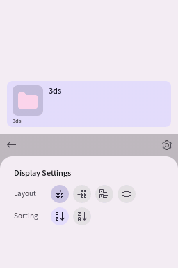
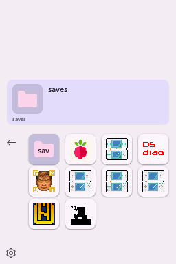

# Using Pico Launcher
This document will outline the different settings and functionalities of Pico Launcher.

## Pico Launcher interface
When Pico Launcher is started, this is how your screen will look like.

From here you can browse your SD card to launch homebrew and games.

- DPAD: Move the selector.
- A: Open a folder, or to launch a homebrew or game.
- B: Go to the parent folder or close a menu.
- L and R: Scroll quickly when there are many items in a folder.
- Y: Open the cheats panel (see [Cheats](Cheats.md)).

The back arrow on the top left of the bottom screen can also be used to go up to the parent folder.

Please note that touch functionality is not supported yet.

## Settings menu
The settings menu can be accessed by using the DPAD to move the selector to the cogwheel icon and pressing A. When in the settings menu, press the B button will to return to the file browser.

Currently, the only settings available are the display mode, and the sorting mode (More settings are available [in the settings file](#settings)). Here is how each layout looks like.

<table>
    <tr>
        <th>Horizontal Grid</th>
        <th>Vertical Grid</th>
        <th>Banner List</th>
        <th>Coverflow</th>
    </tr>
    <tr>
        <td></td>
        <td></td>
        <td></td>
        <td></td>
    </tr>
</table>

## Settings
Settings are stored on your SD card in `/_pico/settings.json`. They can be edited with any text editor. The following settings are available:
- `language` - Display language for Pico Launcher. Currently, only `english` is supported. Other languages may be supported later.
- `romBrowserLayout` - Specified how folder contents are displayed. This setting can be changed in Pico Launcher directly.
- `romBrowserSortMode` - Specified if folder contents should be sorted from A to Z (`NameAscending`), or from Z to A (`NameDescending`). This setting can be changed from within Pico Launcher.
- `theme`: Specifies the folder name of the theme to use. If the theme cannot be found, a default fallback theme will be used.
- `lastUsedFilePath` - Specifies the path of the most recently launched homebrew or game, such that it can be selected the next time Pico Launcher is started. It is automatically updated by Pico Launcher.
- `fileAssociations` - See [FileAssociations.md](/docs/FileAssociations.md) for information about how to use this setting.